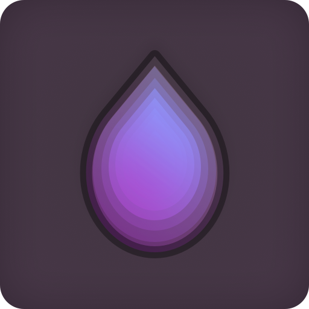

# hdrop
![Backed by Zitane Labs][badge_zitane]
![Powered by Rust][badge_rust]
![MSRV][badge_msrv]
![License: AGPL 3.0][badge_license]
![Github CI][github_ci]

[badge_zitane]: https://badgers.space/badge/Backed%20by/Zitane%20Labs/pink
[badge_rust]: https://badgers.space/badge/Powered%20by/Rust/orange
[badge_msrv]: https://badgers.space/badge/MSRV/1.88.0/green
[badge_license]: https://badgers.space/github/license/ZitaneLabs/hdrop
[github_ci]: https://badgers.space/github/checks/zitanelabs/hdrop



**Simple, self-hosted encrypted file transfer.**

## Features


- Easy to self-host
- Modern UI/UX
- End-to-end encrypted (E2EE)
- Automatic file deletion
- Supports S3 and simple disk storage
- No user accounts
- Metrics included

## Documentation

We are migrating our docs to [the wiki](https://github.com/ZitaneLabs/hdrop/wiki).  
You will find extensive and up-to-date documentation there.

| Name                  | Link                                  |
| --------------------- | ------------------------------------- |
| License               | [LICENSE](./LICENSE)                  |
| Security              | [security.md](./docs/security.md)     |
| API Spec v1 (OpenAPI) | [api_v1.yml](./docs/api_v1.yml)       |
| Changelog             | [changelog.md](./docs/changelog.md)   |

## Production environment

Caddy handles HTTPS and routes `/v1/*` and `/status` to the Rust API. The frontend
uses static files served by unprivileged, read-only Nginx. Node.js/Next.js run only
during builds. See [frontend setup](./frontend/README.md) for configuration and tests.

You'll need Docker Engine, the Compose plugin, and Git. Point your domain at
the host and allow TCP ports 80 and 443.

Generate the Compose `.env` file with Rust installed. You can do this on your
workstation using the same checkout:

```sh
(cd backend && cargo run -p hdrop-env -- --output ../.env)
```

For scripted deployments, pass values with flags and add `--non-interactive`.
Review the generated `TODO_...` values and keep `.env` private in the host's
repository root. To build from source, leave `HDROP_WEB_IMAGE` unset and run:

```sh
docker compose config --quiet
docker compose up -d --build
```

### Prebuilt frontend

CI publishes Linux x86-64 images on pushes to `development` and `production`,
tagged `sha-<full-commit-sha>`. Production pushes also update the `production` tag.
After CI succeeds, set the image in `.env`:

```dotenv
HDROP_WEB_IMAGE=ghcr.io/zitanelabs/hdrop-web:sha-<full-commit-sha>
```

Forks use `ghcr.io/<lowercase-owner>/<lowercase-repository>-web`. Use
`@sha256:<digest>` to pin an image and `docker login ghcr.io` for private packages.
The image works across domains without rebuilding:

```sh
docker compose pull web
docker compose build api
docker compose up -d --no-build
```

This builds only the backend on the host. For frontend updates, change
`HDROP_WEB_IMAGE`, pull again, and run `docker compose up -d --no-build web`.
Keep frontend and backend revisions compatible.

Check `docker compose ps`, `https://<your-host>/status`, and a browser
upload/download round trip, including refreshing the share link.

Bundled Postgres stores its initialized users in the `postgres_data` Docker
volume. If you regenerate `.env` or change `POSTGRES_PASSWORD` after the first
startup, Postgres will keep the old password in that existing volume. Either
update the database role password inside Postgres or, for a disposable installation,
recreate the bundled database volume before starting with the new `.env`.
Recreating the volume deletes its stored data.

## License

At Zitane Labs, we are committed to promoting a free and open Internet. We believe in the principles of open source software and the power of community collaboration.

We have chosen to license hdrop under the Affero General Public License version 3 (AGPLv3) for a few key reasons:

1. **Community Benefit:** The AGPLv3 license ensures that anyone who modifies hdrop and then uses their modified version to provide a service over a network (such as a SaaS product), must make their modifications available to the community. This promotes collaboration and ensures the wider community can benefit from these enhancements.

2. **User Freedom:** The AGPLv3 license gives users the freedom to use, study, share, and modify the software. We believe in these freedoms and want to extend them to all users of hdrop.

3. **Hardened Security:** By requiring users of modified versions to share their modifications, the AGPLv3 license helps to ensure that the software remains secure. Security-relevant modifications are more likely to be shared with the community, and can be upstreamed into the main project to benefit all users.

**hdrop is free for everyone**, and we are committed to keeping it that way.
